## why

在分享这次奇妙经历之前，我们先聊聊刷机是什么，为什么会有刷机的想法...

简单来说刷机就是给硬件换个系统，还可以更改一些底层的代码。他常常和其他两个名词一起出现：**Root**，**ROM**

### Root

经常使用命令行的朋友肯定记得，有一个“以管理员身份运行”的选项，使用Root这一最高权限的身份就有权修改一些系统配置文件。

获取手机的Root权限后就可以干很多有趣的事情：

- 可以删掉一些系统自带但没什么用处的应用

- 提供稳定的虚拟定位，帮你在寝室完成太极拳和健身跑的签到

- 有效去掉手机里的广告

- ...

但越权操作往往伴随着风险，现代知名计算机学者```沃·兹基```经过研究发现如果刷机的某一步操作不当，可能导致手机直接变砖。

当然道高一尺，魔高一丈。市面上有很多变砖复活恢复的方法。

### ROM

ROM， Read-Only Memory

顾名思义：只能读取，无法写入的内存，意味着第一次写入 ROM 后的信息就不能变更了。

手机的 ROM 是用来存放手机固件代码的地方，而刷机要刷的便是手机的固件。

>这里无端想起了尾鱼的作品《肉骨樊笼》，“我们都在这肉骨樊笼中挣扎，是沉沦还是解脱，只在一念之间。”

虽然我们很难更换手机的硬件，但可以更换不同的固件包刷进手机中，赋予它新生。

甚至可以把 windows，ubuntu OS 刷进手机里。

## how

本次使用的是**Redmi K40 pro**，从 **MIUI 13** 刷成 **LineageOS 22**

### 效果图

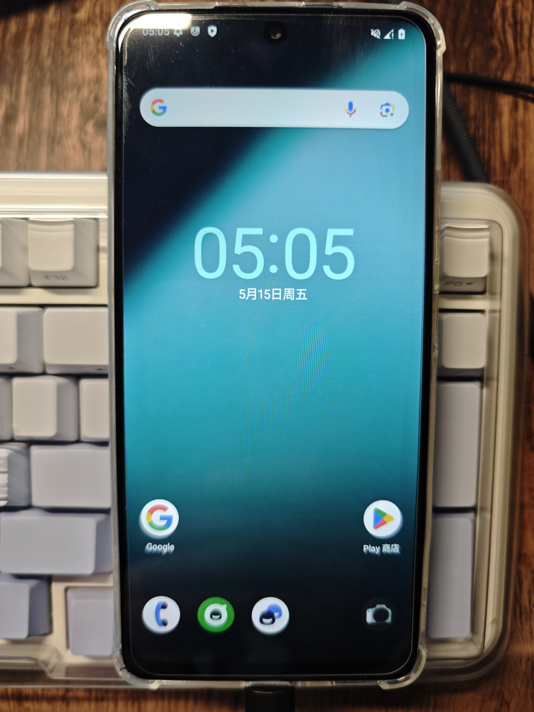

刷好大概长这样，很简洁吧~

### 流程

采用的方式是线刷，即用USB数据线连接电脑刷机

材料与环境准备 --> 解BL锁 --> 选择线刷包（ROM） --> 刷入手机并配置 --> 拓展

#### step 1.1 材料准备

一部手机（带sim卡）、一根原装数据线、一台电脑

#### step 1.2 环境准备

##### step 1.2.1 手机环境准备

1. 登录小米帐号：在手机的设置里登录小米帐号

2. 打开开发者模式：在设置-我的设备-全部参数，连续点击几次 “MIUI版本” 的图标

3. 绑定帐号和设备：在设置-更多设置-开发者选项-设备解锁状态，先关掉WiFi，用手机流量上网，再点击绑定帐号和设备

4. 启用USB调试：在设置-更多设置-开发者选项，开启USB调试模式

##### step 1.2.2 电脑环境准备

1. 检查手机与电脑间USB线的连接

可打开电脑自带的设备管理器（在下方任务栏的搜索框中搜一下），在手机为开机状态时，应呈现为：

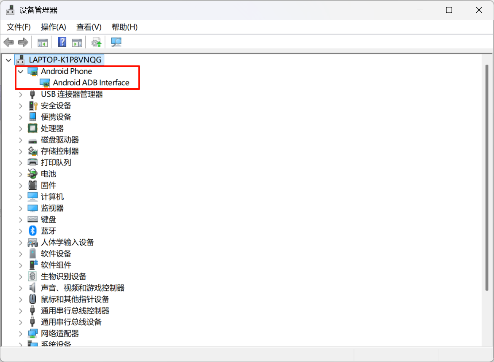

接下来让手机进入fastboot模式：先关机，再同时按住电源键和音量减。在手机为Fastboot模式时，应呈现为：

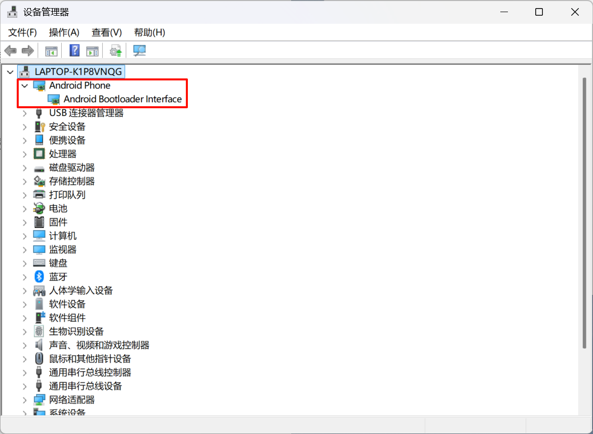

若到这里一切正常可以跳到下一步**安装刷机工具**

有的朋友可能发现手机进入Fastboot模式后，电脑的设备管理器上没有识别到手机的连接，如下图。

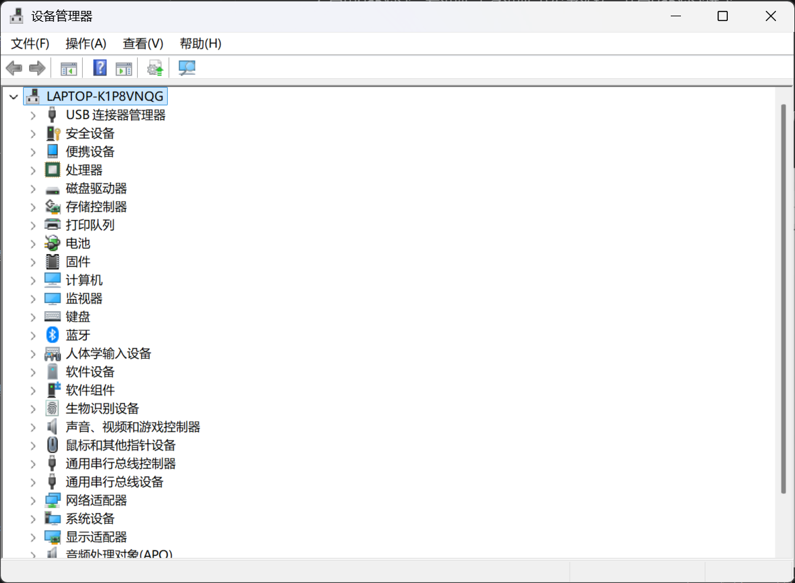

这个时候90%是数据线的问题，主波在一个视频下的评论中找到了答案：

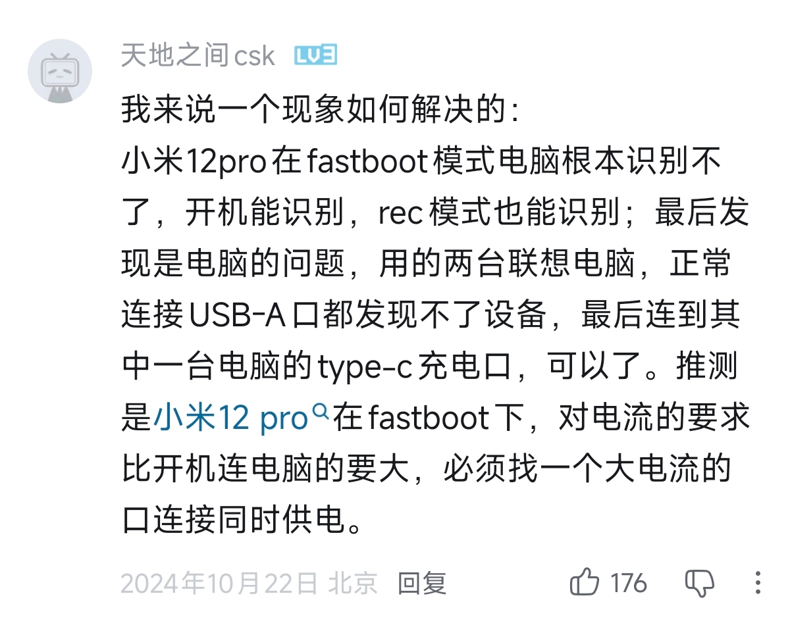

省流就是用一根双c线就能识别出来了。

2. 安装刷机工具

先上链接，一共两个

🔗[解BL锁工具](https://www.miui.com/unlock/download.html)

🔗[线刷工具](https://miuiver.com/miflash/)

#### step 2 解BL锁

先使用第一个工具，🔗[操作流程](https://web.vip.miui.com/page/info/mio/mio/detail?postId=18869159&app_version=dev.20051)

完成其中的```一、解锁Bootloader```

做到点击解锁这一步可能会弹出提示：

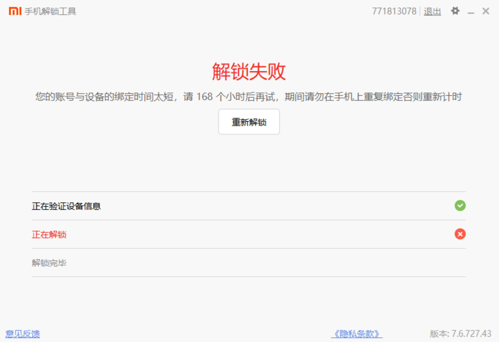

原因是账号要和设备绑定至少一周时间才能解锁。

>A week later...

重新解锁后两眼一黑，依旧失败：


主波又找到了这篇帖子，🔗[小米红米手机解锁BL卡144小时-权限不足-无法成功等情况怎么办？](http://www.romleyuan.com/news/readnews?newsid=8097)

直觉是账号废了，于是上某宝化腐朽为神奇。

>A week later...

这下终于是成功了：

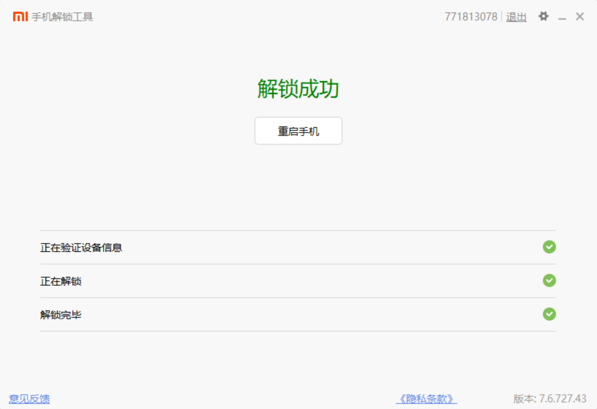

#### step 3 选择线刷包（ROM）

如果是小米系手机寻找线刷包，你可以选择的系统主要分为两大类：小米官方系统和第三方定制系统。

主包选的是比较主流的LineageOS，注意要先查一下要刷的系统是否为自己的设备提供了线刷包。

🔗[LineageOS设备查询](https://wiki.lineageos.org/devices/)

先找到自己对应的设备：

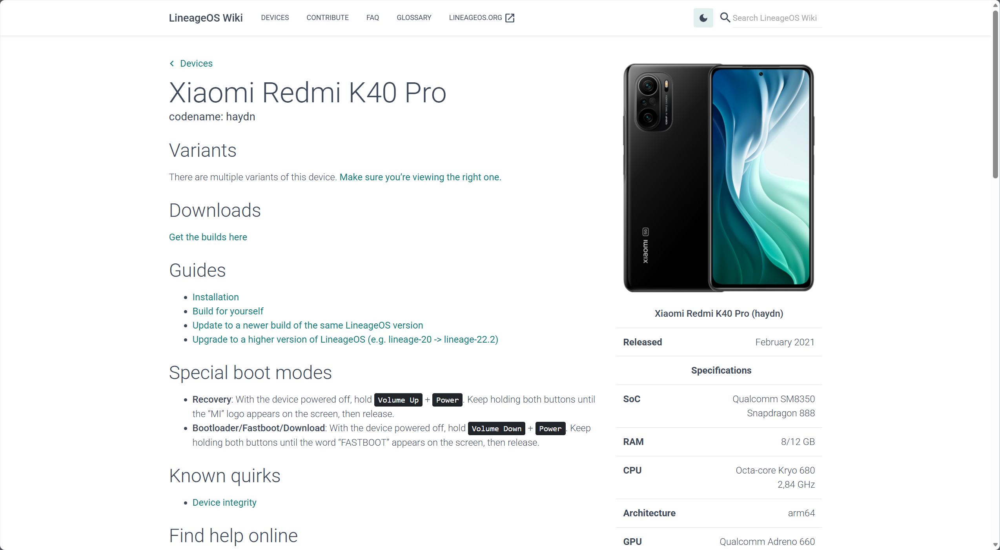

点进安装引导：

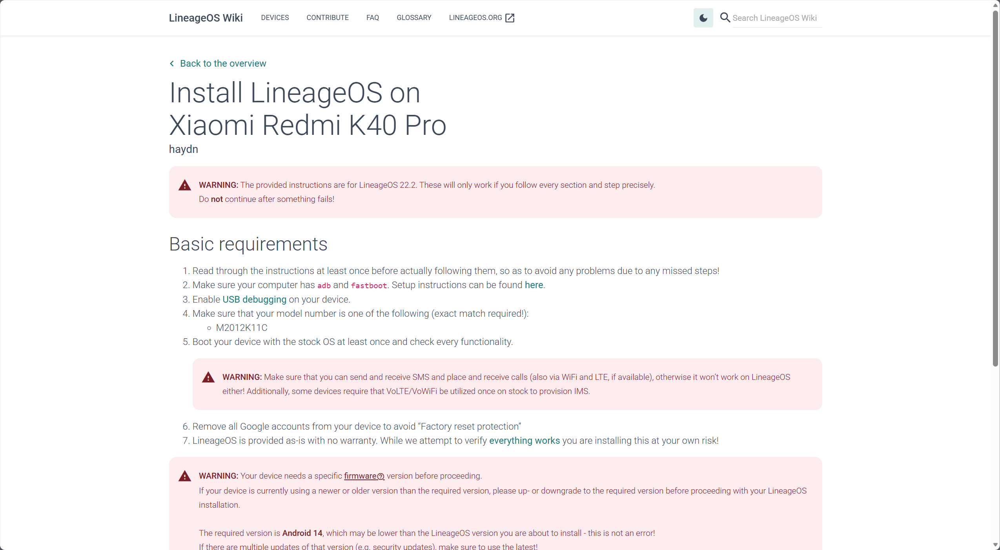

他提到```此设备的 LineageOS 构建需要先安装 Android 14 版本的官方系统```

由于手机原先的版本是 Android 12，所以第一步是刷成小米官方系统中一个版本为 Android 14 的系统。

🔗[小米各机型刷机包历史版本索引](https://miuiver.com/)

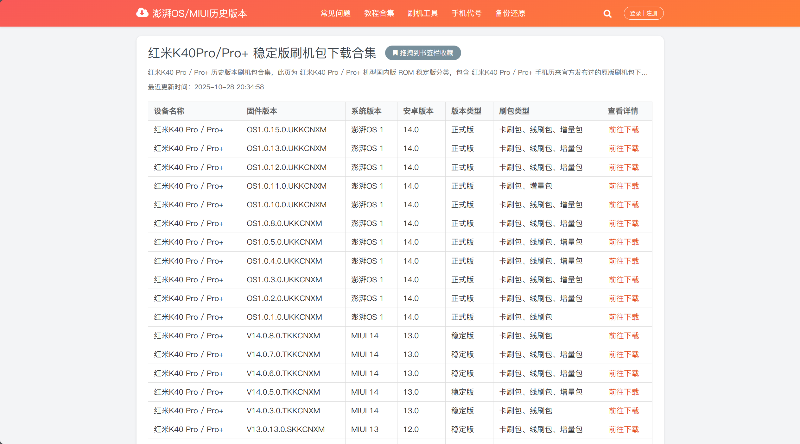

这里选择安卓版本为14.0的最新版本，第一行的线刷包。

接下来将会用到第二个工具，🔗[线刷工具](https://miuiver.com/miflash/)，选择其中一个稳定的版本安装一下，这里以```MiFlash2018-5-28-0```为例。

🔗[操作流程](https://web.vip.miui.com/page/info/mio/mio/detail?postId=18869159&app_version=dev.20051)

完成其中的```二、使用Miflash2018进行线刷```

**但是要注意**，提供操作流程的```6、```中应该选择**全部删除——删除手机全部数据**，否则锁又上回去了。

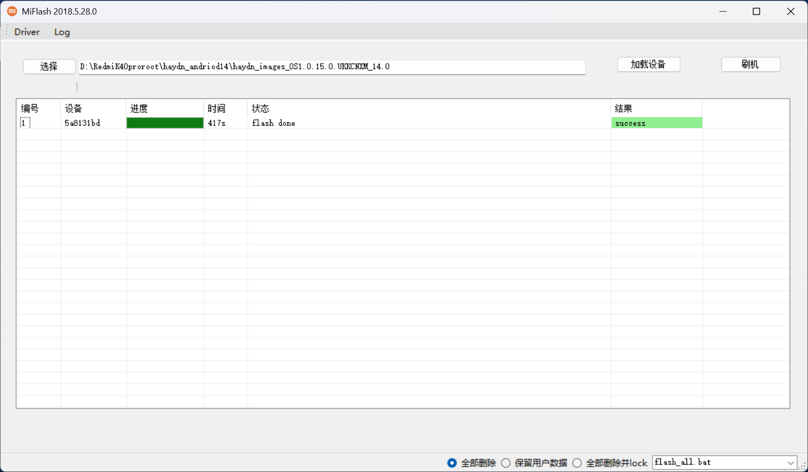

#### step 4 刷入手机并配置

终于 到了最后一步

🔗[操作流程](https://wiki.lineageos.org/devices/haydn/install/variant2/)

后面就很简单了，跟着这个guide一步一步完成就行，从第5步开始，因为前面的工作都完成了：

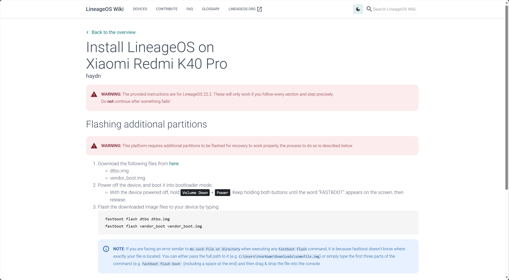

第6步：

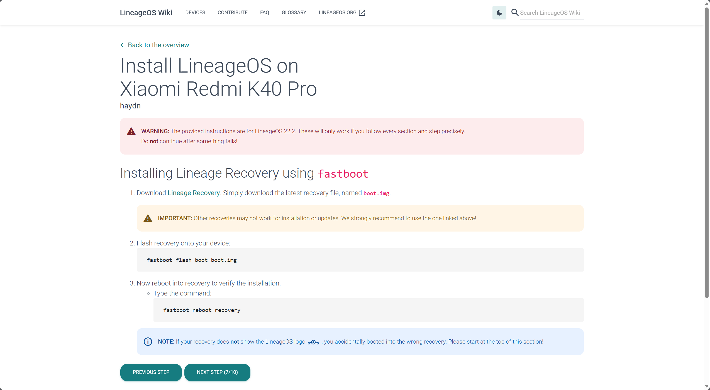

第7步：

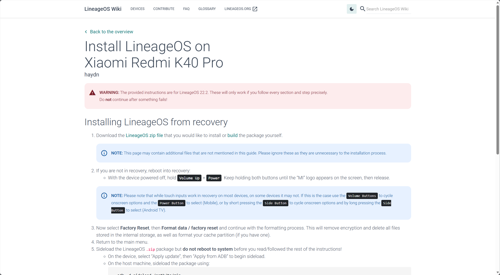

在Recovery模式下进行操作，只能按侧边的按键，点击没用。

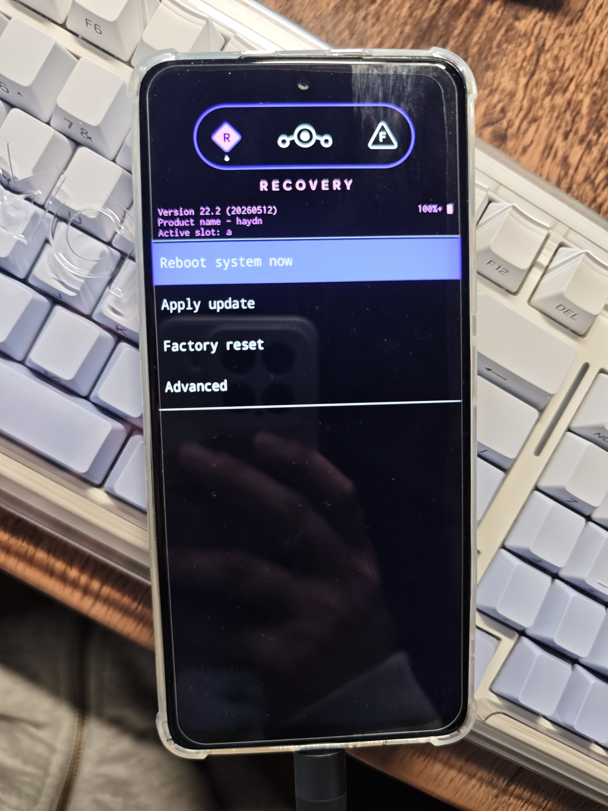

第7步安装完系统包后，在第8步安装需要的第三方服务包，如Google：

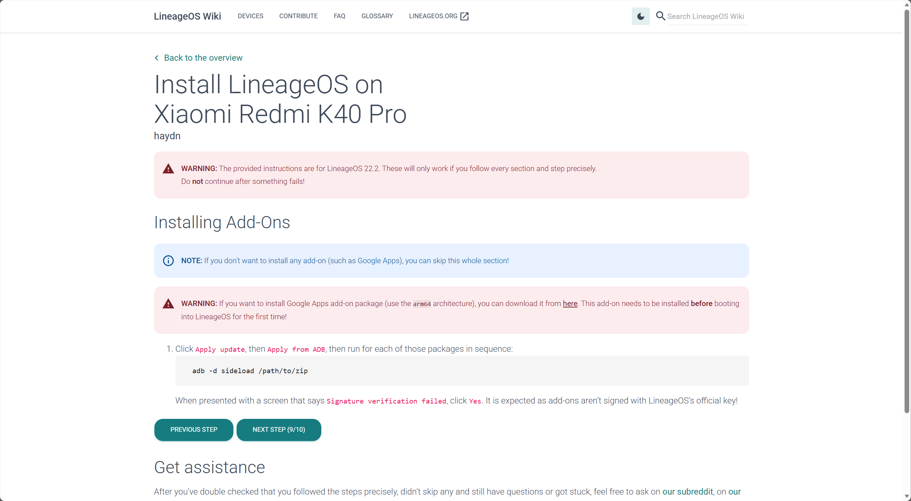

最后的最后，选中**Reboot system now**进行重启，

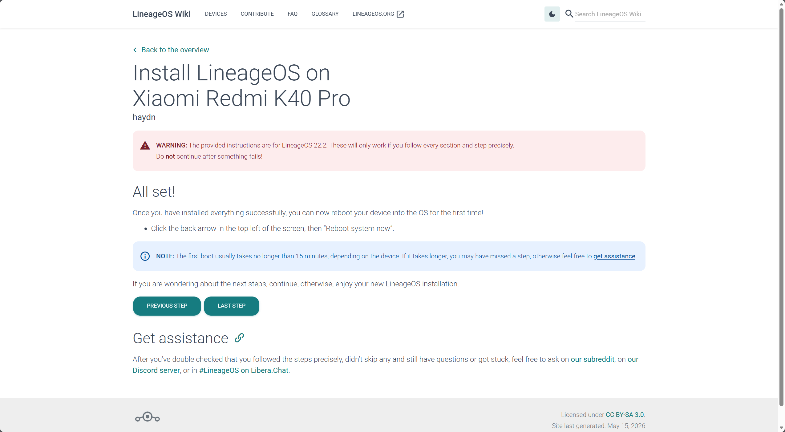

开机后就开始系统初始化了

如果遇到无法解决的问题，可以查阅下面的参考资料或询问AI：

参考资料

- 🔗[小米手机解锁 Bootloader 教程和常见问题](https://web.vip.miui.com/page/info/mio/mio/detail?postId=17982230&app_version=dev.20051)

- 🔗[解锁时提示“未连接小米手机”或Miflash刷机工具刷不出设备](https://web.vip.miui.com/page/info/mio/mio/detail?postId=1980392)

- 🔗[LineageOS wiki](https://wiki.lineageos.org/)

### 结语

Congratulation!

享受更接近原生安卓的体验，就来LineageOS