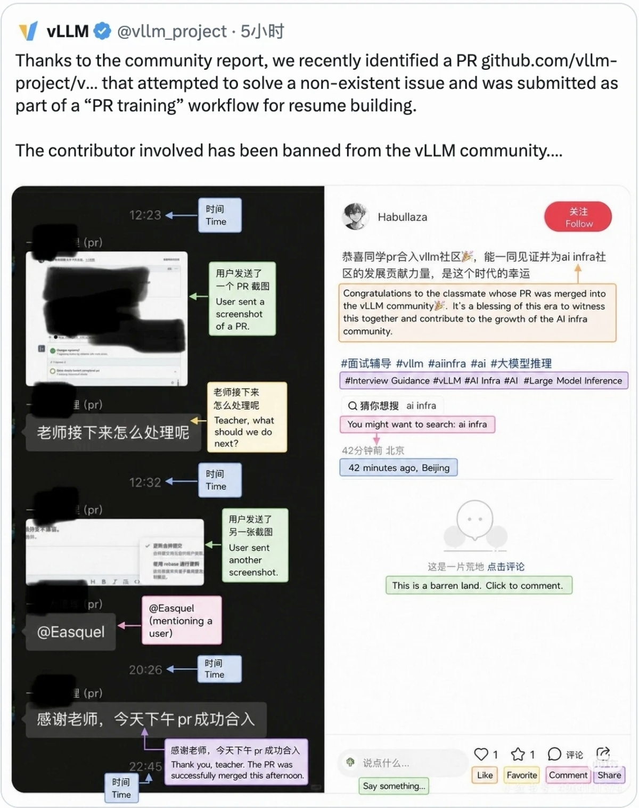

还是前段时间看到的消息：

某培训机构为了让学员获得“开源贡献经历”，人为编造一个不存在的bug，给 vllm 提交了 Issue 和 PR ，维护者可能是没有好好审核给合并了，最后还是被其他贡献者发现并举报的。

一开始看到还是有点毁三观的，心目中github这片开源者的净土都被污染了。

回想起来之前看某hs的时候，每刷到一个github自媒体相关的帖子就是几k followers，几k stars的项目，现在看来可能是打着大厂offer、高学历的幌子来拉群卖课的，甚至附带一些“背景提升”服务。

他们的套路一般是塑造一段励志经历，博取一些人的共情，接着利用同龄人之间攀比的心理散播焦虑，从而收割迷路的韭菜。

怪不得说教培来钱快，因为糊弄人不需要成本，全靠一张嘴，愿者上钩。

至于上钩之人，他们可能更关注“我很努力，为了xxx还报了课程学习”这一行为，而忽视课程本身的内容，我觉得这是缺乏自主性的表现。

在这个信息纷杂的时代，能够客观看待所闻所见，不被带节奏的人带偏，拥有自己的思考（无论错对 是十分可贵的。

自主是不盲从、不被动接受，这种认识的方法可以解放你以不同的视角评析这件事可能的一些影响，不陷入“集体”中的01博弈。

抛开上面这件事，比如现在讨论学编程要不要在网上报课，有人想跟up主买个课上，有人主张找资料自学。

我们不该把这个问题当成单选，从长期来看，可能自学能力的培养更为重要，但如果是短期需要补充个技能包，可能报课的效果会好一些，直接的经验补充在功利上还是胜过慢慢摸索。

如果要做个选择，这好比是LLM的底层能力和RAG外挂的知识库（或许没有那么恰当，对我而言在完全理解一样事物后（与之相反的是，用不到我就不需要知道），运用起来会更得心应手。

当构建了自主思考的内核，我们才能真正把握自己的人生权重。